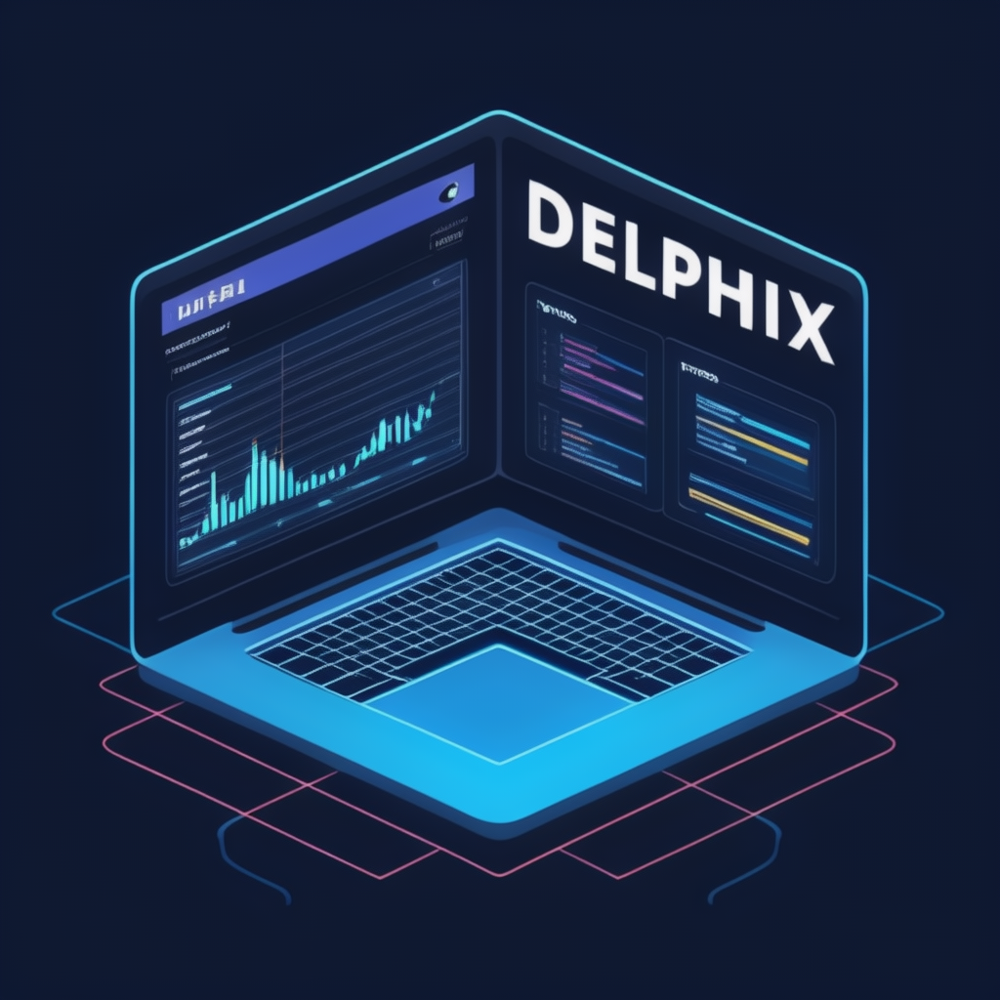
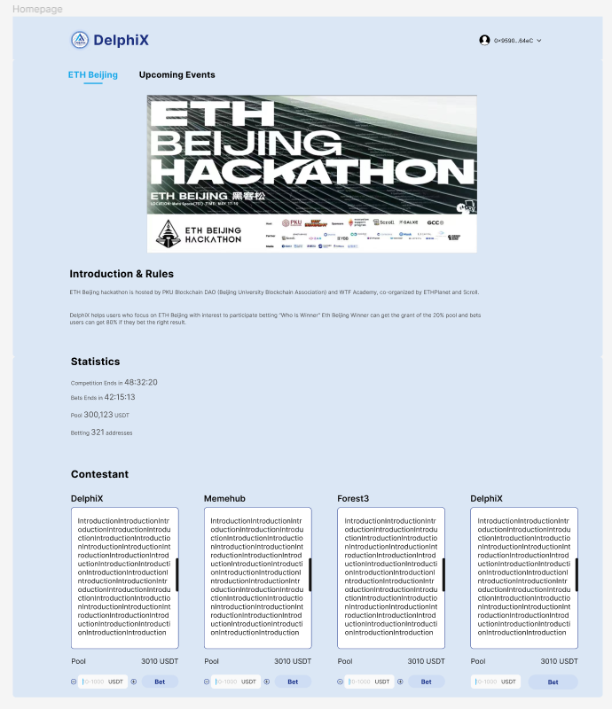

<h1>DelphiX</h1>
<h2></h2>
<h3>DelphiX, ushering you into a new era of hackathon competition predictions!</h3>

 

## Overview

- Project Name: DelphiX
- Try it out: https://web-liard-three.vercel.app/
- Selected Track:

    - SCROLL & XXX

- Project Images
    - 
- Introduction:

    - DelphiX is a hackathon results prediction and betting platform built on blockchain technology. Users can predict the champions of hackathon events through the platform and earn rewards based on odds.
- [Whitepaper](./design/wiki-en.md)
- Design:
    1. Network
        - [Scroll Sepolia Testnet](https://scroll.io/)

    2. **Full On-Chain Staking**:
        - Employs blockchain technology to ensure transparency and security in the betting process, with all transaction records being public and immutable.
        - Utilizes smart contracts to automatically execute bets and distribute winnings, guaranteeing fairness and efficiency.
        - Allows users to stake USDC on teams they believe will win before the competition begins.

    3. **Event Information Display**:
        - Provides detailed information on hackathon events, including team introductions, competition rules, schedules, etc.
        - Updates event progress in real-time to ensure users have access to the latest information.

    4. **Results Revelation & Prize Distribution**:
        - The betting deadline is set 24 hours before the end of the hackathon. Betting amounts are flexible with minimum stakes suitable for participants at various levels.
        - Results are instantly announced via the blockchain network after the event, ensuring transparency of outcomes.
        - 80% of the prize pool is allocated to participants who correctly predict the champion, while 20% is used to sponsor the winning hackathon team, aiding project promotion.
        - Prizes are automatically distributed through smart contracts, ensuring efficiency and safety.

    5. **Project Highlights**:
        - **Innovation**: Introduces a betting mechanism to hackathon events, adding a new interactive experience to competitions.
        - **Blockchain Technology**: Leverages blockchain to ensure transparency, fairness, and security in the betting process.
        - **Engagement**: Enhances viewer engagement, making watching the competitions more enjoyable and challenging.
        - **Smart Contracts**: Implements smart contracts for automatic bet execution and prize distribution, ensuring fairness and efficiency.
        - **Community Interaction**: Fosters user communication and interaction through community features, boosting platform activity.
        - **Philanthropy**: Allocates 20% of the betting prizes as sponsorship for the hackathon winners, supporting technological innovation and event promotion.

    6. **Future Plans**:
        - **Platform Expansion**: Aims to extend to more types of tech competitions, such as coding contests and technology challenges.
        - **Feature Enhancement**: Introduce innovative features like live interaction and virtual prizes to further elevate the user experience.
        - **Market Outreach**: Expand user base, enhance platform recognition, and influence through collaborations and promotional activities.

- Team Leader and Members:

    1. Team Leader: Rix
    2. Team Members: [See Contributors](#Contributors)

- Demo Video Link: [coming soon...](https://youtu.be)
- [Pitch Deck](https://github.com/LXJ2/DelphiX/blob/main/design/assets/DelphiXv4.pdf)

## Contributors
- Rix 产品经理  
- 0xSkipper 全栈工程师  
- YYY 合约与后端工程师  
- Rere web3前端开发工程师  
- Sanji 合约工程师  
